# 架构概览

> 由 architecture-map 技能生成于 2026-08-31（会话归属修正 + 图片附件；同日经 refactor-review 抽出 `history` / `resources` / `jsonc-file` 后更新）；模块结构变化后需重新生成。

项目为 VS Code 插件：侧边栏 / 编辑区标签页共享的 webview 聊天 UI + 扩展宿主侧的 Pi SDK 适配层。源码全部在 `src/`，两个独立 bundle 由 `esbuild.mjs` 产出（`dist/extension.js` 为 Node/CJS，`dist/webview.js` 为浏览器/IIFE）。

## 模块一览

| 模块 | 路径 | 职责 | 主要依赖 |
|------|------|------|----------|
| extension | `src/extension.ts` | 插件入口：注册侧边栏 webview、编辑区 `WebviewPanel` serializer、命令、diff content provider、自检（`runAllDiagnostics()`，不再自己维护一份自检清单）与终端真机探针；静态注册 OAuth flows | vscode, pi-ai/bun-oauth, chat-surfaces, diagnostics, diff-view, http, terminal-spike |
| chat-surfaces | `src/chat-surfaces.ts` | `ChatSurfaceManager`：把 sidebar 与**任意多个**编辑区 `WebviewPanel` 当作可替换 GUI surface（三个区域：辅助侧边栏 / 编辑区 / 新窗口，后两者在 API 层同为 panel，区域靠 `PanelRegion` 记账 + `viewColumn === One` 校正），管理每个顶层会话自己的 `PiRuntime` + `ChatBridge`、session claim、sidebar 的 workspaceState 启动记忆与每个 tab 自带的 webview-state 记忆、sidebar 原生 `…` submenu 与 editor 内置 `…` 中按区域分成两套 `when` 的四项移动/新建命令（三个菜单均为「移到另外两个区域 + 在编辑区/新窗口新开」）；会话列表选择已被可见 surface claim 的会话时，把原 controller 移到点击方并给来源 surface 一个空的新会话；运行中的被替换 controller 转为 background，无面保活到 settle；窗口级 `EventEmitter` 向所有 bridge 广播会话列表 invalidation；serializer 逐个恢复 tab 时先同步画 webview shell，再异步重建 controller，避免 reload 黑屏；共享 webview HTML / CSP | vscode, bridge, runtime, diff-view, protocol |
| runtime | `src/agent/runtime.ts` | `PiRuntime`：SDK `AgentSessionRuntime` 薄封装；session 新建/继续、替换后重新 bindExtensions；`createIsolatedServices()` 让并存的顶层/子会话共享模型与设置但各有 ResourceLoader / 扩展 runtime；切换前可把已被其他 surface claim 的会话重定向过去；按配置注入自有工具 `subagent` / `vscode_terminal`（内置优先，始终屏蔽扩展的同名工具）；扩展 UI 与错误经 sink 转到 transcript；持有 dispose 级 `AbortSignal` | vscode, pi-coding-agent, pi-ai, subagent, vscode-terminal, config, http |
| bridge | `src/agent/bridge.ts` | `ChatBridge`：SDK `AgentSessionEvent` → `HostMessage`，webview 消息 → runtime 操作；历史回放、资源清单、技能/提示词/扩展归属标注、子代理观察者、图片附件的接收与处理（`attachImage` / `detachImage`）、models.json 保存后重新加载与错误上报；订阅窗口级会话 invalidation，仅在窄屏会话页 / 宽屏左栏可见时用 trailing debounce 重扫；**「当前显示什么」由单一 `View` 联合类型表示**（`live` / `lane` / `replay`） | vscode, pi-coding-agent, protocol, auth, activity, commands, session-tree, session-title, model-config, diff-view, project-files, runtime, skills, invocations, subagent, images, config, history, resources, shared/time |
| history | `src/agent/history.ts` | 持久化 transcript → `ChatEvent` 的纯投影：`buildHistoryEntryEvents()`（compaction 边界、工具调用与结果配对）与 **必须与它逐条对应**的 `bubbleEntryIds()`（红线，同居一个文件就是保证对应关系的手段），另有 live 链路也用的 `resultText()` / `toolFilePath()`。无 vscode API、无 bridge 状态，自检可直接从会话文件驱动 | pi-coding-agent, protocol, session-title, skills, invocations, tool-details |
| resources | `src/agent/resources.ts` | 资源面板的清单投影（Context / Skills / Prompts / Extensions / Tools）：对 `ResourceLoader` 的纯函数，`ResourceHost` 为结构型接口以便自检传一个裸 session；只列 pi 官方的资源类型 | pi-coding-agent, protocol, activity |
| jsonc-file | `src/agent/jsonc-file.ts` | 向共享 JSONC 配置文件写入单个值的唯一手段（`modify()` + 整文档 `WorkspaceEdit` + `save()`，保留注释与格式、与已打开的编辑器同步、走与手改相同的保存触发重载）；三态返回值区分「写了 / 本来就如此 / 失败」。**故意狭窄**：只服务现有的两个整条目粒度写入，不得在它之上长出字段级配置编辑器 | vscode, jsonc-parser |
| commands | `src/agent/commands.ts` | 斜杠命令目录（命名对齐 CLI）与内置命令分发；prompt 模板/扩展命令仅做补全展示，实际由 `AgentSession.prompt()` 处理 | vscode, pi-coding-agent, protocol, runtime, session-tree, session-title |
| invocations | `src/agent/invocations.ts` | 提示词模板与扩展命令的归属判定：在 `prompt()` 改写文本之前解析用户输入，回放时按无占位符的模板正文精确匹配，弥补 SDK 无「模板已使用 / 命令已执行」事件 | pi-coding-agent |
| skills | `src/agent/skills.ts` | 技能路径索引与工具调用归属判定（`SKILL.md` 读取 = 自动加载，技能目录内文件 = 技能资源），弥补 SDK 无「技能已加载」事件 | node:path, pi-coding-agent, protocol |
| session-title | `src/agent/session-title.ts` | 用户消息显示文本与会话标题的**单一口径**：`readUserDisplay()`（折叠 `<skill>` + 剥 `<image>` 标记，并给出调用了哪个技能）、`userDisplayText()`（内容数组）与 `userDisplayFromText()`（已是纯文本的来源，如扫盘的 `SessionInfo.firstMessage`）；transcript、会话列表、header、重命名预填、会话树、排队中的气泡全走它——各自拷贝一份已经分叉过一次（列表里出现 `<image name="…">`） | pi-coding-agent, skills, images |
| images | `src/agent/images.ts` | 图片附件处理：把 composer 交来的字节整成 SDK 的 `ImageContent`——白名单直通（png/jpeg/gif/webp）、其余经 SDK 导出的 `convertToPng` 转 PNG（非图片在此被识破）、按共享设置 `images.autoResize` 调用 `resizeImage` 并附坐标换算说明；`<image name="…">` 标记随用户消息进正文（形状对齐 CLI 的 `@file`），展示前由 `stripImageAttachmentMarkup()` 剥掉。只做编排不复刻算法，故不标 `SDK-MIRROR:` | pi-coding-agent, node:path, host i18n |
| tool-details | `src/agent/tool-details.ts` | 工具 `AgentToolResult.details` 跨界前的清洗：排除有专用卡片的工具（仅 pi 自带七个；`subagent` 虽有卡片但**不在列中**，它的卡片正是用 `details` 画的），其余按深度/条目/字符预算截断并剔除不可结构化克隆的值。不认任何扩展的 schema | protocol |
| activity | `src/agent/activity.ts` | `ActivityTracker`：宿主侧「本会话中真正生效过」的判定，供资源面板点亮 Context / Extensions 两栏。上下文文件按「已发出过请求」判定；扩展按 `Extension.handlers` 订阅的事件 + 已观察到的会话事件（含 bind 时的 `session_start`）推断，另加 `onError` 直证 | pi-coding-agent, protocol |
| session-tree | `src/agent/session-tree.ts` | `/tree` `/fork` `/clone`：用原生 QuickPick 驱动 session 条目树导航与分支操作 | vscode, pi-coding-agent, runtime |
| settings-menu | `src/agent/settings-menu.ts` | header “设置”菜单：供应商/常用模型/默认工具/shell 路径/子代理入口 + 11 项 CLI `/settings` 选项（auto-compact、默认思考等级、steering/follow-up、信任、skill 命令、重试、transport、超时、图片、警告）+ 打开设置文件；选项全部写 `~/.pi/agent/settings.json`（与 CLI 互通），“子代理”一项不自己收值，只把 VS Code 设置界面定位到 `piAgentChat.subagent`；`defaultTools` 多选（SDK 只有 getter）先选作用域：用户写 `~/.pi/agent/settings.json`、工作区写 `<cwd>/.pi/settings.json`（SDK 深合并、项目覆盖全局，CLI 读同样两份），均经 jsonc modify + WorkspaceEdit 写入后 `settingsManager.reload()`；用户域全选四件即删键恢复默认、全不选写 `[]`，工作区域总写显式列表（含全选，用于钉住），另有「清除工作区覆盖」删键回落用户设置；菜单行摘要在被覆盖时标注 (workspace) | vscode, pi-coding-agent, jsonc-parser, runtime, config, host i18n |
| model-picker | `src/agent/model-picker.ts` | 两层模型选择：`buildModelCatalog()` 为 composer 快捷菜单提供常用模型，`pickModel()` 是完整原生 QuickPick（搜索 / 能力详情 / ⭐常用 / 📌默认），`/scoped-models` 批量管理；常用模型以 `provider/modelId` 写入共享设置 `enabledModels`（语义对齐 CLI） | vscode, runtime, protocol, host i18n |
| model-config | `src/agent/model-config.ts` | 自定义供应商：定位 / 打开共享的 `~/.pi/agent/models.json`，空文件写入带注释的整份模板、已有内容但尚无供应商时向 `providers` 顶部插入一条模板（文本插入以保留每个字段的注释，不自动保存）、已配置供应商则直接打开不再插入，列出文件中定义的 provider，并用 `jsonc-parser` + `WorkspaceEdit` 删除单个 provider；不做表单向导（schema 太大且 CLI 无对等物） | vscode, jsonc-parser, pi-coding-agent, host i18n |
| auth | `src/agent/auth.ts` | 登录/登出流程：把 SDK `AuthInteraction` / `AuthPrompt` 映射到 VS Code 原生对话框；供应商列表首行提供「自定义供应商（models.json）」入口，models.json 定义的供应商行带 🗑 删除按钮 | vscode, pi-ai, runtime, model-config |
| subagent | `src/agent/subagent.ts` | `SubagentCoordinator`：以自定义工具形式并行运行多个 SDK 子 session，父 session 在工具调用中等待；每路独立 services 与写入范围；向观察者广播每路事件与进展 | typebox, pi-coding-agent, scope, scoped-tools, config |
| scope | `src/agent/scope.ts` | 子代理写入范围：路径前缀规范化（非 glob，重叠必须可判定）、启动前重叠检查、`ScopeGuard`（越界拒绝 + 写入记账） | node:path |
| scoped-tools | `src/agent/scoped-tools.ts` | 用 SDK 导出的 `createEditToolDefinition` / `createWriteToolDefinition` 重建同名 `edit`/`write`，仅替换文件操作层以实施范围强制与记账；读不受限；bash 无法覆盖 | node:fs, pi-coding-agent, scope |
| vscode-terminal | `src/agent/vscode-terminal.ts` | `VsCodeTerminalPool` 与 `vscode_terminal` 工具：在用户可见、可键入的集成终端中执行命令（`run`/`list`/`read`/`close` 四个动作互相咬合）；终端跨调用复用、只认自己创建的、**绝不自动关闭**；无 shell integration 时拒绝执行而非返回空；超时不 kill 只汇报「还在跑」；输出按 SDK 的 `truncateTail` 走与 `bash` 同一预算。终端 API 经 `TerminalApi` 注入，自检可用脚本化实现驱动 | vscode, typebox, pi-coding-agent, terminal-replay, config |
| terminal-replay | `src/agent/terminal-replay.ts` | 迷你 VT 重放：遵从光标指令而不是剥离它们（剥离会留下被覆盖的幻影文本），输出屏幕文本 + 光标行；光标行是 `read` 增量续读的边界，使进度条重绘不会被当成新行。零依赖，附 8 条用例供 spike 与 `pnpm verify` 共用 | — |
| terminal-spike | `src/agent/terminal-spike.ts` | 真机探针（命令面板触发）：shell integration 激活耗时、用户键入是否可捕获、增量交付、退出码保真、调度延迟；replay 用例复用 `terminal-replay`，两边不漂移 | vscode, terminal-replay, diagnostics |
| config | `src/agent/config.ts` | 插件自有能力的 VS Code 配置（并行子代理开关 / 并行上限 / 子代理默认模型；终端工具开关 / 终端数上限；消息折叠阈值），按 workspace folder 解析，并提供打开 VS Code 设置界面用的 section id | vscode |
| diagnostics | `src/agent/diagnostics.ts` | 冒烟/风险自检，清单就是 `DIAGNOSTIC_SUITES` 这一份（命令与 `scripts/smoke_load.mjs` 都遍历它，新增一项自检只改这里）：surface session claim 与无面 runtime 生命周期、SDK 加载、undici 版本、jiti、clipboard、历史回放、斜杠命令、手动重试（私有 prompt 路径存在 + 重发不新增用户消息 + 从磁盘重开仍提供重试）、session 树、子代理工具（开关两态 + 子会话排除）、扩展 `subagent` 屏蔽、范围强制、子会话隔离、图片附件（处理 / 拒绝 / 气泡投影 / 标记不外显）、终端工具（开关两态 + 同名屏蔽 + 无 shell integration 时拒绝执行 + 超时不 kill + 增量读 + `close` 只碰自己创建的终端）、**视图状态机**（驱动真实 `ChatBridge` 并断言 `postState()` 的输出）、文件索引、可选的真实 LLM 调用 | pi-coding-agent, chat-surfaces, bridge, runtime, commands, session-tree, subagent, scope, scoped-tools, vscode-terminal, diff-view, project-files, resume, images, history, resources, session-title, config |
| project-files | `src/agent/project-files.ts` | `ProjectFileIndex`：`@` 文件引用的索引/搜索/校验，含缓存、二进制与敏感文件过滤、引用数上限 | node:child_process, node:fs, protocol |
| resume | `src/agent/resume.ts` | 请求异常中断后的手动重发：判定会话是否停在失败响应上（`stopReason === "error"`）、丢弃该响应（只丢 agent state，会话文件不动）并经 SDK 私有 prompt 路径以空消息批继续；私有入口做特性探测，缺失即不提供该动作。提供时机在 `bridge` 的 `agent_settled`，回放时由 `postHistory()` 重算 | pi-coding-agent |
| diff-view | `src/agent/diff-view.ts` | `pi-agent-chat-original` URI scheme：反向应用 patch 还原编辑前内容并打开 `vscode.diff` | diff, vscode |
| http | `src/agent/http.ts` | 代理解析（env > pi `settings.json` 的 `httpProxy` > VS Code `http.proxy`）与全局 undici dispatcher 安装/重建；行为对齐 SDK 未导出的 `core/http-dispatcher.ts` | node:events, vscode, undici, pi-coding-agent |
| errors | `src/agent/errors.ts` | `describe()` / `describeWithStack()`：宿主侧统一的错误文本提取 | — |
| protocol | `src/shared/protocol.ts` | host ↔ webview 消息与状态类型（`ChatEvent`/`ChatState`/`HostMessage`/`WebviewMessage`）与共享常量（`MAX_FILE_REFERENCES` / `MAX_IMAGE_ATTACHMENTS` / 宽屏几何常量）；**零依赖** | — |
| shared/time | `src/shared/time.ts` | 双端共用的时间戳格式化：协议上走 ISO 8601 UTC，显示时按本机时区渲染成固定的 `YYYY-MM-DD HH:MM`（不用 `toLocaleString()`，否则会话列表这一列参差、且 DOM 快照会依赖宿主 ICU 语言）；**零依赖** | — |
| messages | `src/shared/messages.ts` | 宿主侧全部面向用户文案的中英字典（`sharedMessages` 固定串 + `sharedTemplates` 参数化模板）与 `isChinese()`/`localize()`；webview `i18n.ts` 也引用它；**零依赖** | — |
| agent/i18n | `src/agent/i18n.ts` | 宿主侧取文案入口 `t()` / `tf()`，按 `vscode.env.language` 解析 | vscode, shared/messages |
| webview/main | `src/webview/main.ts` | 应用外壳：页面布局（聊天/会话页/认证门）、事件接线、`HostMessage` 路由；同一个 `ResizeObserver` 按配置阈值（`piAgentChat.layout.wideModeMinWidth`，默认 1200）切换窄 / 宽模式；**跨过阈值不自动打开任何侧栏**，只改变 header 两个开关的语义；侧栏开合与拖拽宽度持久化在 webview state | 全部 webview 模块 |
| webview/splitter | `src/webview/splitter.ts` | 宽屏三栏的两条可拖拽中缝：唯一的几何作者（四个 CSS 变量落到 `_wide.scss` 的轨道）；三条 clamp——侧栏 ≤ `RAIL_MAX_WIDTH`、拖到 < `RAIL_MIN_WIDTH` 即关闭该栏、中栏不得低于 `CENTER_MIN_WIDTH`；可用宽度由 `setAvailableWidth()` 喂入而**不测量 DOM** | protocol, host, shell |
| webview/scrollbars | `src/webview/scrollbars.ts` | 滚动条的「正在滚动」状态：document 上一个 capture 阶段的 `scroll` 监听给被滚元素加 `pi-scrolling`、静置 900ms 摘掉，`_tokens.scss` 据此把 `::-webkit-scrollbar-thumb` 从透明切到 slider 色。CSS 没有这个状态，所以「亮一会儿」只能由这里的延时承担；伪元素规则不加选择器限定，一个监听即覆盖全部滚动容器（含后建的代码块与弹层），不需要滚动容器清单 | — |
| webview/shell | `src/webview/shell.ts` | 静态页面骨架（`#root` innerHTML）与所有元素引用；`surface-body` 包含 sessions / 中缝 / chat-column / 中缝 / resources 五个 grid 区域，中间 `.content-column` 共用 `--content-max-width` 上限；editor 类 surface 隐藏重复的 header 会话标题 | i18n, icons |
| webview/store | `src/webview/store.ts` | 唯一的 `ChatState` 快照（live binding + `setState`） | protocol |
| webview/host | `src/webview/host.ts` | `acquireVsCodeApi()` 封装，唯一的 `post()` 出口 | protocol |
| webview/transcript | `src/webview/transcript.ts` | 消息区：气泡、图片缩略图条、work block、思考/工具/通知卡片（含技能徽章）、diff 渲染、粘底滚动、运行指示器；每条用户消息与 agent 回答对称地挂会话树动作条（回溯 / 分叉 / 标签，按位置绑定 entryId），并为搜索提供「逐层展开」（reveal 注册表）与未渲染懒加载 body 的可搜索文本（`collectHiddenBodies`） | bubble, collapsible, dom, format, host, markdown, resources-view, shell, spinner, store |
| webview/composer | `src/webview/composer.ts` | 输入区：发送/steer/follow-up、`/` 命令补全、`@` 文件选择器与引用 chip、粘贴图片附件（缩略图 chip，处理与校验都在宿主）、↑/↓ 输入历史、拖拽调整高度 | dom, format, host, shell, store, transcript |
| webview/sessions-view | `src/webview/sessions-view.ts` | 会话列表渲染与行内操作：窄模式为替换聊天的整页，宽模式为可切换左栏；标题 / 搜索固定，只有列表行滚动，跨 surface 状态刷新保留批次数与滚动位置；被其它 controller claim 的行仍可点击并移动同一个 controller | dom, format, host, shell, spinner, store, transcript |
| webview/resources-view | `src/webview/resources-view.ts` | 资源面板（Context / Skills / Prompts / Extensions / Tools）：窄模式为顶部面板，宽模式为右栏；首次布局按初始宽度设置默认可见 / 展开值，此后两种模式共享同一份可见与顶层折叠状态；绿色 = 本会话中生效过，灰斜体 = 已配置但未生效 | collapsible, dom, host, shell |
| webview/search | `src/webview/search.ts` | transcript 搜索（header 按钮触发，无键绑定——webview 的 keydown 会被工作台键绑定服务先行转发，拦不住默认的编辑器搜索）：字面、大小写不敏感、空白归一化的查询对语料匹配（语料构建方式对齐 TUI 全屏搜索），Enter/Shift+Enter 导航；语料分两层——DOM 文本（含折叠的卡片与长消息，文本仍在 DOM）与从未渲染过的懒加载卡片 body 的数据层文本（`collectHiddenBodies`），导航命中折叠区域时层层展开（`revealTranscriptElement`）；高亮走 CSS Custom Highlight API 不改 DOM（jsdom 降级为仅计数/导航），MutationObserver 防抖重算 | i18n, shell, transcript |
| webview/statusline | `src/webview/statusline.ts` | CLI 风格底部状态行（tokens / 缓存 / 成本 / 上下文占用），以及扩展经 `ctx.ui.setStatus` 发布的独立状态行（后者不受窄面板整行隐藏规则影响） | dom, format, protocol, shell, store |
| webview/widgets | `src/webview/widgets.ts` | 扩展经 `ctx.ui.setWidget` 发布的纯文本块，按 `aboveEditor` / `belowEditor` 落在 composer 上下两侧；只渲染 SDK 的 `string[]` 重载，component factory 重载属 TUI-only 不实现 | collapsible, dom, protocol, shell |
| webview/picker | `src/webview/picker.ts` | composer 的模型 / 思考等级快捷菜单：小弹层对齐 chip 弹出，模型行只有名称 + 供应商（仅常用模型，为空时显示「无」），末尾「其他模型…」交给原生完整 picker | dom, host, i18n, icons, shell, store |
| webview/collapsible | `src/webview/collapsible.ts` | 唯一的「折叠头 + 懒渲染 body」组件；四套 class 命名作为配置 | dom, icons, i18n |
| webview/overflow | `src/webview/overflow.ts` | 工具栏收纳组：面板过窄时把次要按钮搬进「⋯」弹层（换行探针判定，非硬编码断点） | dom |
| webview/dom · spinner · icons · format | `src/webview/{dom,spinner,icons,format}.ts` | DOM 构造helper、共享 spinner 动画、SVG 图标常量、截断/格式化与显示上限 | — |
| webview/i18n | `src/webview/i18n.ts` | zh/en 双语字典，按 `<html lang>` 选择 | shared/messages |
| webview/markdown | `src/webview/markdown.ts` | marked 渲染 + DOM 层标签/属性白名单净化 + 为每个代码块补复制按钮与语法高亮（均在净化之后注入） | clipboard, dom, highlight, i18n, marked |
| webview/highlight | `src/webview/highlight.ts` | highlight.js core + 手选语言子集；只高亮 fence 声明的语言（不做自动探测），带结果缓存供流式重渲染 | format, highlight.js |
| webview/bubble | `src/webview/bubble.ts` | 正式消息气泡：内容容器（折叠只裁剪它）+ 页脚（折叠开关 / 复制原文）+ 附件条；长消息折叠判定按 Markdown 源长度（无头可复现） | clipboard, dom, format, i18n, markdown, protocol |
| webview/clipboard | `src/webview/clipboard.ts` | 复制按钮（消息 / 代码块）；写剪贴板交给宿主的 `copyText` | dom, host, i18n, icons |
| build & scripts | `esbuild.mjs`, `scripts/` | 双 bundle 构建、运行时包复制到 `dist/node_modules`、`import.meta.url/resolve` 重写；`check_bundle.py` 校验产物、`check_terminal_replay.mjs` 用 esbuild 编译 `terminal-replay.ts` 后跑重放用例、`smoke_load.mjs` 跑宿主 diagnostics、`smoke_webview.mjs` 在 jsdom 中比对 webview DOM 快照 | esbuild, jsdom, node |

## 依赖关系图

```mermaid
graph TD
  subgraph host["扩展宿主 (dist/extension.js)"]
    extension[extension.ts]
    surfaces[chat-surfaces.ts]
    bridge[agent/bridge]
    runtime[agent/runtime]
    commands[agent/commands]
    skills[agent/skills]
    tooldetails[agent/tool-details]
    invocations[agent/invocations]
    activity[agent/activity]
    sessiontree[agent/session-tree]
    sessiontitle[agent/session-title]
    history[agent/history]
    resources[agent/resources]
    jsoncfile[agent/jsonc-file]
    images[agent/images]
    settingsmenu[agent/settings-menu]
    modelpicker[agent/model-picker]
    modelconfig[agent/model-config]
    auth[agent/auth]
    subagent[agent/subagent]
    scope[agent/scope]
    scopedtools[agent/scoped-tools]
    vscodeterminal[agent/vscode-terminal]
    terminalreplay[agent/terminal-replay]
    terminalspike[agent/terminal-spike]
    pluginconfig[agent/config]
    projectfiles[agent/project-files]
    resume[agent/resume]
    diffview[agent/diff-view]
    http[agent/http]
    errors[agent/errors]
    hosti18n[agent/i18n]
    diagnostics[agent/diagnostics]
  end
  subgraph web["Webview (dist/webview.js)"]
    main[webview/main]
    transcript[webview/transcript]
    composer[webview/composer]
    sessionsview[webview/sessions-view]
    resourcesview[webview/resources-view]
    statusline[webview/statusline]
    search[webview/search]
    widgets[webview/widgets]
    picker[webview/picker]
    splitter[webview/splitter]
    scrollbars[webview/scrollbars]
    collapsible[webview/collapsible]
    overflow[webview/overflow]
    shell[webview/shell]
    store[webview/store]
    hostapi[webview/host]
    i18n[webview/i18n]
    markdown[webview/markdown]
    highlight[webview/highlight]
    bubble[webview/bubble]
    clipboard[webview/clipboard]
    domutil["webview/dom · spinner · icons · format"]
  end
  protocol[shared/protocol]
  messages[shared/messages]
  time[shared/time]
  sdk["@earendil-works/pi-coding-agent + pi-ai"]

  extension --> surfaces
  surfaces --> bridge
  surfaces --> runtime
  extension --> diagnostics
  extension --> diffview
  extension --> http
  extension --> terminalspike
  extension --> sdk

  bridge --> runtime
  bridge --> auth
  bridge --> commands
  bridge --> settingsmenu
  bridge --> modelpicker
  bridge --> modelconfig
  auth --> modelconfig
  modelconfig --> jsoncfile
  settingsmenu --> jsoncfile
  modelconfig --> hosti18n
  modelconfig --> sdk
  modelpicker --> runtime
  modelpicker --> hosti18n
  commands --> settingsmenu
  settingsmenu --> runtime
  settingsmenu --> hosti18n
  settingsmenu --> pluginconfig
  bridge --> sessiontree
  bridge --> sessiontitle
  bridge --> history
  bridge --> resources
  history --> sessiontitle
  history --> skills
  history --> invocations
  history --> tooldetails
  history --> protocol
  resources --> activity
  resources --> protocol
  bridge --> images
  sessiontitle --> images
  images --> hosti18n
  images --> sdk
  sessiontitle --> skills
  sessiontitle --> sdk
  commands --> sessiontitle
  bridge --> skills
  bridge --> tooldetails
  tooldetails --> protocol
  bridge --> invocations
  bridge --> activity
  activity --> protocol
  skills --> protocol
  bridge --> diffview
  bridge --> projectfiles
  bridge --> resume
  bridge --> subagent
  bridge --> pluginconfig
  bridge --> protocol
  bridge --> time
  bridge --> messages
  bridge --> hosti18n
  bridge --> errors
  bridge --> sdk

  commands --> hosti18n
  sessiontree --> hosti18n
  auth --> hosti18n
  diffview --> hosti18n
  runtime --> hosti18n
  hosti18n --> messages

  commands --> sessiontree
  commands --> runtime
  commands --> protocol
  sessiontree --> runtime
  sessiontree --> sessiontitle
  auth --> runtime
  settingsmenu --> http
  runtime --> http
  runtime --> subagent
  runtime --> vscodeterminal
  subagent --> vscodeterminal
  vscodeterminal --> sdk
  vscodeterminal --> terminalreplay
  vscodeterminal --> pluginconfig
  terminalspike --> terminalreplay
  runtime --> pluginconfig
  runtime --> sdk
  subagent --> sdk
  subagent --> scope
  subagent --> scopedtools
  scopedtools --> sdk
  scopedtools --> scope
  projectfiles --> protocol

  diagnostics --> surfaces
  diagnostics --> bridge
  diagnostics --> commands
  diagnostics --> sessiontree
  diagnostics --> subagent
  diagnostics --> vscodeterminal
  diagnostics --> scope
  diagnostics --> scopedtools
  diagnostics --> diffview
  diagnostics --> projectfiles
  diagnostics --> resume
  diagnostics --> images
  diagnostics --> history
  diagnostics --> resources
  diagnostics --> sessiontitle
  diagnostics --> pluginconfig
  diagnostics --> sdk

  main --> protocol
  main --> transcript
  main --> composer
  main --> sessionsview
  main --> resourcesview
  main --> statusline
  main --> widgets
  main --> picker
  main --> search
  main --> splitter
  main --> scrollbars
  splitter --> shell
  splitter --> hostapi
  splitter --> protocol
  search --> shell
  search --> i18n
  search --> transcript
  picker --> shell
  picker --> store
  picker --> hostapi
  picker --> i18n
  picker --> domutil
  main --> overflow
  overflow --> domutil
  main --> shell
  main --> store
  main --> hostapi
  main --> i18n

  transcript --> collapsible
  transcript --> shell
  transcript --> store
  transcript --> hostapi
  transcript --> markdown
  transcript --> bubble
  bubble --> markdown
  bubble --> clipboard
  markdown --> clipboard
  markdown --> highlight
  clipboard --> hostapi
  transcript --> resourcesview
  transcript --> domutil
  composer --> transcript
  composer --> shell
  composer --> store
  composer --> hostapi
  composer --> protocol
  sessionsview --> transcript
  sessionsview --> time
  sessionsview --> shell
  sessionsview --> store
  sessionsview --> hostapi
  resourcesview --> collapsible
  resourcesview --> shell
  resourcesview --> hostapi
  statusline --> shell
  statusline --> store
  widgets --> shell
  widgets --> collapsible
  widgets --> protocol
  collapsible --> domutil
  collapsible --> i18n
  shell --> i18n
  store --> protocol
  hostapi --> protocol
  i18n --> messages
```

当前源码中未发现模块间循环依赖（`npx madge --circular --extensions ts src` 校验）。

## 关键约定

- **用户消息的显示文本只有一个投影**（`agent/session-title.ts`）：折叠 `<skill>` 块、剥掉 `<image …>` 附件标记。transcript、会话列表、header 标题、重命名预填、`/tree` 导航、排队中的气泡全部调它；只有存进会话文件与重发给模型的文本保留原标记。
- **分层方向**：宿主 `extension` → `bridge` → 功能模块 → `runtime` → SDK；webview `main`（装配/布局/路由）→ 面板模块 → `shell`/`store`/`host`/工具模块。`shared/` 下的 `protocol`、`messages` 与 `time` 是仅有的双端共享模块，必须保持零依赖（webview 打包不能引入 Node 代码）。
- **入口点**：宿主 `src/extension.ts#activate`（激活事件 `onView:piAgentChat.view` / `onWebviewPanel:piAgentChat.editor`）；webview `src/webview/main.ts`（IIFE，顶层执行）。
- **webview 模块协作**：跨模块依赖一律通过 `initComposer()` / `initSessions()` 传入回调，不使用发布订阅；页面布局（聊天页/会话页/认证门的显示切换）只由 `main.ts` 决定。
- **数据流**：每个顶层 controller 的 SDK `AgentSessionEvent` → `ChatBridge` → 当前 surface 的 `HostMessage` → `main.ts`；用户操作 → `WebviewMessage` → surface 对应的 `ChatBridge` → `PiRuntime`/`AgentSession`。同一 session file 由窗口级 claim 表保证只属于一个 controller。
- **session 替换**：`PiRuntime` 持有 `AgentSessionRuntime`，每次 session 被替换（new/resume/fork/tree）必须重新 `bindExtensions()` 并重订阅事件，统一走 `ChatBridge.attach()`；并存 runtime 不共享 ResourceLoader / 扩展实例。
- **扩展输出**：pi 扩展的 `ctx.ui.notify` 不弹原生通知，而是由 `PiRuntime.setExtensionNoticeSink()`（`ChatBridge` 构造时注入，必须早于首次 `bindExtensions()`）转成 `status` / `error` 事件写进对应 session 的 transcript；扩展命令执行期间标 `scope: "command"`（顶层展开卡片），其余时间不标（收进 work block）。
- **配置复用**：会话与配置全部落在 `~/.pi/agent/`（`getAgentDir()`），与终端 Pi 互操作；插件不维护私有配置副本。VS Code 配置项只用于**插件独有的能力**（subagent 的三项、终端工具的两项、消息折叠阈值），共享能力一律走 `~/.pi/agent/`。
- **工具集**：插件只在 pi 默认的 `read`/`bash`/`edit`/`write` 之外注册 `subagent` 与 `vscode_terminal` 两个工具，且两者都**默认关闭**、由 VS Code 配置开启；不调用 `setActiveToolsByName()`（自定义工具在 session 构造时已随 `includeAllExtensionTools` 激活）。扩展注册的同名工具 **始终屏蔽**（与开关无关）：名字归本窗口自己的工具所有——开关开时靠 SDK 工具注册表的覆盖语义赢，开关关时经 `excludeTools` 整体排除（扩展式 `subagent` 实现在扩展宿主里本就 spawn 出 VS Code 自身并静默返回空结果，屏蔽不丢能力）。`grep`/`find`/`ls` 等其他能力由 `~/.pi/agent/extensions/` 下的 pi 扩展提供，CLI 与 GUI 共享。
- **图片附件**：webview 只负责取到剪贴板里的 `File` 并显示缩略图 chip，字节经 `attachImage` 交给宿主；解码、格式归一、按共享设置 `images.autoResize` 缩放与 base64 编码全在 `agent/images.ts`（架在 SDK 导出的 photon 原语上），发送时以 `ImageContent` 进 prompt、以 `<image name="…">` 标记进正文，展示前再由 `stripImageAttachmentMarkup()` 剥掉。
- **构建约束**：`vscode`、`@silvia-odwyer/photon-node`、`@mariozechner/clipboard` 为 external；`undici` 通过 alias 强制指向本仓库固定版本（当前 8.10.0，需 ≥ SDK 自带版本）；生产构建把 SDK 等运行时包复制进 `dist/node_modules`，并用 banner 重写 `import.meta.url` / `import.meta.resolve`。
- **本地化**：宿主侧面向用户的文案（原生对话框、QuickPick、transcript 状态提示）全部定义在 `shared/messages.ts`，由 `agent/i18n.ts` 的 `t()`/`tf()` 按 `vscode.env.language` 解析；webview 侧由 `webview/i18n.ts` 按 `<html lang>` 解析。有意保留英文：`/` 命令目录（对齐 CLI）、spike 诊断命令、SDK/模型产生的文本。
- **安全**：webview CSP 严格（脚本需 nonce），模型输出经 `markdown.ts` 白名单净化后才插入 DOM；`project-files.ts` 过滤敏感文件名与二进制扩展名。
- **测试**：`pnpm verify` = 构建 + `check_bundle.py`（产物校验）+ `smoke_load.mjs`（宿主 diagnostics）+ `smoke_webview.mjs`（jsdom DOM 快照，基线 `scripts/webview-snapshot.txt`）。**自检清单只有一份**：`DIAGNOSTIC_SUITES`（`agent/diagnostics.ts`），命令与 smoke 脚本都只是遍历它——清单曾经拆成四份拷贝，漏改一处的后果是新自检在 `pnpm verify` 里静默不跑。改动 webview 后快照差异即回归信号，确认无误再 `--update`。
