# 架构概览

> 由 architecture-map 技能生成于 2026-08-03（webview 拆分后更新）；模块结构变化后需重新生成。

项目为 VS Code 插件：侧边栏 webview 聊天 UI + 扩展宿主侧的 Pi SDK 适配层。源码全部在 `src/`，两个独立 bundle 由 `esbuild.mjs` 产出（`dist/extension.js` 为 Node/CJS，`dist/webview.js` 为浏览器/IIFE）。

## 模块一览

| 模块 | 路径 | 职责 | 主要依赖 |
|------|------|------|----------|
| extension | `src/extension.ts` | 插件入口：`activate()` 注册 webview view `piAgentChat.view`、4 个命令、diff content provider；`ChatViewProvider` 懒创建 `PiRuntime` + `ChatBridge`；用 `workspaceState` 记住上次显示的会话（含未落盘的新会话）以决定启动时打开哪个 session；静态注册 OAuth flows | vscode, pi-ai/bun-oauth, bridge, diagnostics, diff-view, http, runtime, protocol |
| runtime | `src/agent/runtime.ts` | `PiRuntime`：SDK `AgentSessionRuntime` 薄封装；session 新建/继续、替换后重新 bindExtensions、**始终**注入 subagent 工具（内置优先，屏蔽扩展的同名工具；被屏蔽者经 `findShadowedSubagentExtension()` 与 `shadowedSubagentExtension` 仅用于告知）、按 `enabledModels` 解析会话 scoped models；扩展 UI 的 `ctx.ui.notify` 与扩展 handler 报错（`bindExtensions({ onError })`）经注入的 sink 转到 transcript（无 sink 时 notify 回退原生弹窗）；持有 dispose 级 `AbortSignal` 并贯穿所有 auth/model 调用 | vscode, pi-coding-agent, subagent |
| bridge | `src/agent/bridge.ts` | `ChatBridge`：SDK `AgentSessionEvent` → `HostMessage`，webview 消息 → runtime 操作；历史回放（`buildHistoryEvents`）、资源清单、技能/提示词/扩展归属标注、子代理观察者、models.json 保存后重新加载与错误上报；**「当前显示什么」由单一 `View` 联合类型表示**（`live` / `lane` / `replay`），所有派生状态从它算出 | vscode, pi-coding-agent, protocol, auth, activity, commands, session-tree, session-title, model-config, diff-view, project-files, runtime, skills, invocations, subagent |
| commands | `src/agent/commands.ts` | 斜杠命令目录（命名对齐 CLI）与内置命令分发；prompt 模板/扩展命令仅做补全展示，实际由 `AgentSession.prompt()` 处理 | vscode, pi-coding-agent, protocol, runtime, session-tree, session-title |
| invocations | `src/agent/invocations.ts` | 提示词模板与扩展命令的归属判定：在 `prompt()` 改写文本之前解析用户输入，回放时按无占位符的模板正文精确匹配，弥补 SDK 无「模板已使用 / 命令已执行」事件 | pi-coding-agent |
| skills | `src/agent/skills.ts` | 技能路径索引与工具调用归属判定（`SKILL.md` 读取 = 自动加载，技能目录内文件 = 技能资源），弥补 SDK 无「技能已加载」事件 | node:path, pi-coding-agent, protocol |
| session-title | `src/agent/session-title.ts` | 会话标题的单一口径：用户设定的名字，否则首条用户消息（`<skill>` 块折叠回 `/skill:name`）。供 header 标题与 `/name`、会话列表重命名的输入框预填共用，保证「列表里看到的标题」与「重命名框里的初始值」一致 | pi-coding-agent, skills |
| tool-details | `src/agent/tool-details.ts` | 工具 `AgentToolResult.details` 跨界前的清洗：排除有专用卡片的工具（仅 pi 自带七个；`subagent` 虽有卡片但**不在列中**，它的卡片正是用 `details` 画的），其余按深度/条目/字符预算截断并剔除不可结构化克隆的值。不认任何扩展的 schema | protocol |
| activity | `src/agent/activity.ts` | `ActivityTracker`：宿主侧「本会话中真正生效过」的判定，供资源面板点亮 Context / Extensions 两栏。上下文文件按「已发出过请求」判定；扩展按 `Extension.handlers` 订阅的事件 + 已观察到的会话事件（含 bind 时的 `session_start`）推断，另加 `onError` 直证 | pi-coding-agent, protocol |
| session-tree | `src/agent/session-tree.ts` | `/tree` `/fork` `/clone`：用原生 QuickPick 驱动 session 条目树导航与分支操作 | vscode, pi-coding-agent, runtime |
| settings-menu | `src/agent/settings-menu.ts` | header “设置”菜单：供应商/常用模型/shell 路径/子代理入口 + 11 项 CLI `/settings` 选项（auto-compact、默认思考等级、steering/follow-up、信任、skill 命令、重试、transport、超时、图片、警告）+ 打开设置文件；除子代理一项外全部写 `~/.pi/agent/settings.json`（与 CLI 互通） | vscode, pi-coding-agent, runtime, subagent-settings, host i18n |
| subagent-settings | `src/agent/subagent-settings.ts` | “子代理”表单（插件独有能力，不入共享设置）：先选写入作用域（工作区 / 用户），再编辑开关 / 最大并行数 / 子代理默认模型，经 `workspace.getConfiguration().update()` 落盘到 VS Code 设置 | vscode, config, runtime, host i18n |
| model-picker | `src/agent/model-picker.ts` | 两层模型选择：`buildModelCatalog()` 为 composer 快捷菜单提供常用模型，`pickModel()` 是完整原生 QuickPick（搜索 / 能力详情 / ⭐常用 / 📌默认），`/scoped-models` 批量管理；常用模型以 `provider/modelId` 写入共享设置 `enabledModels`（语义对齐 CLI） | vscode, runtime, protocol, host i18n |
| model-config | `src/agent/model-config.ts` | 自定义供应商：定位 / 打开共享的 `~/.pi/agent/models.json`，空文件写入带注释的整份模板、已有内容则向 `providers` 顶部插入一条新模板（文本插入以保留每个字段的注释，id 自动错开，不自动保存），列出文件中定义的 provider，并用 `jsonc-parser` + `WorkspaceEdit` 删除单个 provider；不做表单向导（schema 太大且 CLI 无对等物） | vscode, jsonc-parser, pi-coding-agent, host i18n |
| auth | `src/agent/auth.ts` | 登录/登出流程：把 SDK `AuthInteraction` / `AuthPrompt` 映射到 VS Code 原生对话框；供应商列表首行提供「自定义供应商（models.json）」入口，models.json 定义的供应商行带 🗑 删除按钮 | vscode, pi-ai, runtime, model-config |
| subagent | `src/agent/subagent.ts` | `SubagentCoordinator`：以自定义工具形式并行运行多个 SDK 子 session，父 session 在工具调用中等待；每路独立 services 与写入范围；向观察者广播每路事件与进展 | typebox, pi-coding-agent, scope, scoped-tools, config |
| scope | `src/agent/scope.ts` | 子代理写入范围：路径前缀规范化（非 glob，重叠必须可判定）、启动前重叠检查、`ScopeGuard`（越界拒绝 + 写入记账） | node:path |
| scoped-tools | `src/agent/scoped-tools.ts` | 用 SDK 导出的 `createEditToolDefinition` / `createWriteToolDefinition` 重建同名 `edit`/`write`，仅替换文件操作层以实施范围强制与记账；读不受限；bash 无法覆盖 | node:fs, pi-coding-agent, scope |
| config | `src/agent/config.ts` | 插件自有能力的 VS Code 配置（并行子代理开关 / 并行上限 / 子代理默认模型），按 workspace folder 解析，并提供按作用域读写（workspace / user）的落盘入口 | vscode |
| diagnostics | `src/agent/diagnostics.ts` | 冒烟/风险自检：SDK 加载、undici 版本、jiti、clipboard、历史回放、斜杠命令、session 树、子代理工具（开关两态 + 子会话排除）、扩展 `subagent` 屏蔽、范围强制、子会话隔离、**视图状态机**（驱动真实 `ChatBridge` 并断言 `postState()` 的输出）、文件索引、可选的真实 LLM 调用 | pi-coding-agent, bridge, commands, session-tree, subagent, scope, scoped-tools, diff-view, project-files |
| project-files | `src/agent/project-files.ts` | `ProjectFileIndex`：`@` 文件引用的索引/搜索/校验，含缓存、二进制与敏感文件过滤、引用数上限 | node:child_process, node:fs, protocol |
| diff-view | `src/agent/diff-view.ts` | `pi-agent-chat-original` URI scheme：反向应用 patch 还原编辑前内容并打开 `vscode.diff` | diff, vscode |
| http | `src/agent/http.ts` | 代理解析（env > pi `settings.json` 的 `httpProxy` > VS Code `http.proxy`）与全局 undici dispatcher 安装/重建；行为对齐 SDK 未导出的 `core/http-dispatcher.ts` | node:events, vscode, undici, pi-coding-agent |
| errors | `src/agent/errors.ts` | `describe()` / `describeWithStack()`：宿主侧统一的错误文本提取 | — |
| protocol | `src/shared/protocol.ts` | host ↔ webview 消息与状态类型（`ChatEvent`/`ChatState`/`HostMessage`/`WebviewMessage`）与共享常量 `MAX_FILE_REFERENCES`；**零依赖** | — |
| messages | `src/shared/messages.ts` | 宿主侧全部面向用户文案的中英字典（`sharedMessages` 固定串 + `sharedTemplates` 参数化模板）与 `isChinese()`/`localize()`；webview `i18n.ts` 也引用它；**零依赖** | — |
| agent/i18n | `src/agent/i18n.ts` | 宿主侧取文案入口 `t()` / `tf()`，按 `vscode.env.language` 解析 | vscode, shared/messages |
| webview/main | `src/webview/main.ts` | 应用外壳：页面布局（聊天/会话页/认证门）、事件接线、`HostMessage` 路由 | 全部 webview 模块 |
| webview/shell | `src/webview/shell.ts` | 静态页面骨架（`#root` innerHTML）与所有元素引用 | i18n, icons |
| webview/store | `src/webview/store.ts` | 唯一的 `ChatState` 快照（live binding + `setState`） | protocol |
| webview/host | `src/webview/host.ts` | `acquireVsCodeApi()` 封装，唯一的 `post()` 出口 | protocol |
| webview/transcript | `src/webview/transcript.ts` | 消息区：气泡、work block、思考/工具/通知卡片（含技能徽章）、diff 渲染、粘底滚动、运行指示器 | bubble, collapsible, dom, format, host, markdown, resources-view, shell, spinner, store |
| webview/composer | `src/webview/composer.ts` | 输入区：发送/steer/follow-up、`/` 命令补全、`@` 文件选择器与引用 chip、拖拽调整高度 | dom, format, host, shell, store, transcript |
| webview/sessions-view | `src/webview/sessions-view.ts` | 会话列表页渲染与行内操作（恢复/删除/查看父子会话） | dom, format, host, shell, spinner, store, transcript |
| webview/resources-view | `src/webview/resources-view.ts` | 资源面板（Context / Skills / Prompts / Extensions / Tools；不含 Themes，也不含任何非 pi 官方的资源类型）：header 按钮控制显隐；绿色 = 本会话中生效过（transcript 可见的技能/工具/提示词/扩展命令，并与宿主下发的 `item.used` 取并集），灰斜体 = 已配置但未生效，其余为常规前景色 | collapsible, dom, host, shell |
| webview/statusline | `src/webview/statusline.ts` | CLI 风格底部状态行（tokens / 缓存 / 成本 / 上下文占用），以及扩展经 `ctx.ui.setStatus` 发布的独立状态行（后者不受窄面板整行隐藏规则影响） | dom, format, protocol, shell, store |
| webview/widgets | `src/webview/widgets.ts` | 扩展经 `ctx.ui.setWidget` 发布的纯文本块，按 `aboveEditor` / `belowEditor` 落在 composer 上下两侧；只渲染 SDK 的 `string[]` 重载，component factory 重载属 TUI-only 不实现 | collapsible, dom, protocol, shell |
| webview/picker | `src/webview/picker.ts` | composer 的模型 / 思考等级快捷菜单：小弹层对齐 chip 弹出，模型行只有名称 + 供应商（仅常用模型，为空时显示「无」），末尾「其他模型…」交给原生完整 picker | dom, host, i18n, icons, shell, store |
| webview/collapsible | `src/webview/collapsible.ts` | 唯一的「折叠头 + 懒渲染 body」组件；四套 class 命名作为配置 | dom, icons, i18n |
| webview/overflow | `src/webview/overflow.ts` | 工具栏收纳组：面板过窄时把次要按钮搬进「⋯」弹层（换行探针判定，非硬编码断点） | dom |
| webview/dom · spinner · icons · format | `src/webview/{dom,spinner,icons,format}.ts` | DOM 构造helper、共享 spinner 动画、SVG 图标常量、截断/格式化与显示上限 | — |
| webview/i18n | `src/webview/i18n.ts` | zh/en 双语字典，按 `<html lang>` 选择 | shared/messages |
| webview/markdown | `src/webview/markdown.ts` | marked 渲染 + DOM 层标签/属性白名单净化 + 为每个代码块补复制按钮与语法高亮（均在净化之后注入） | clipboard, dom, highlight, i18n, marked |
| webview/highlight | `src/webview/highlight.ts` | highlight.js core + 手选语言子集；只高亮 fence 声明的语言（不做自动探测），带结果缓存供流式重渲染 | format, highlight.js |
| webview/bubble | `src/webview/bubble.ts` | 正式消息气泡：内容容器 + 页脚（折叠开关 / 复制原文）；长消息折叠判定按 Markdown 源长度（无头可复现） | clipboard, dom, format, i18n, markdown |
| webview/clipboard | `src/webview/clipboard.ts` | 复制按钮（消息 / 代码块）；写剪贴板交给宿主的 `copyText` | dom, host, i18n, icons |
| build & scripts | `esbuild.mjs`, `scripts/` | 双 bundle 构建、运行时包复制到 `dist/node_modules`、`import.meta.url/resolve` 重写；`check_bundle.py` 校验产物、`smoke_load.mjs` 跑宿主 diagnostics、`smoke_webview.mjs` 在 jsdom 中比对 webview DOM 快照 | esbuild, jsdom, node |

## 依赖关系图

```mermaid
graph TD
  subgraph host["扩展宿主 (dist/extension.js)"]
    extension[extension.ts]
    bridge[agent/bridge]
    runtime[agent/runtime]
    commands[agent/commands]
    skills[agent/skills]
    tooldetails[agent/tool-details]
    invocations[agent/invocations]
    activity[agent/activity]
    sessiontree[agent/session-tree]
    sessiontitle[agent/session-title]
    settingsmenu[agent/settings-menu]
    subagentsettings[agent/subagent-settings]
    modelpicker[agent/model-picker]
    modelconfig[agent/model-config]
    auth[agent/auth]
    subagent[agent/subagent]
    scope[agent/scope]
    scopedtools[agent/scoped-tools]
    pluginconfig[agent/config]
    projectfiles[agent/project-files]
    diffview[agent/diff-view]
    http[agent/http]
    errors[agent/errors]
    hosti18n[agent/i18n]
    diagnostics[agent/diagnostics]
  end
  subgraph web["Webview (dist/webview.js)"]
    main[webview/main]
    transcript[webview/transcript]
    composer[webview/composer]
    sessionsview[webview/sessions-view]
    resourcesview[webview/resources-view]
    statusline[webview/statusline]
    widgets[webview/widgets]
    picker[webview/picker]
    collapsible[webview/collapsible]
    overflow[webview/overflow]
    shell[webview/shell]
    store[webview/store]
    hostapi[webview/host]
    i18n[webview/i18n]
    markdown[webview/markdown]
    highlight[webview/highlight]
    bubble[webview/bubble]
    clipboard[webview/clipboard]
    domutil["webview/dom · spinner · icons · format"]
  end
  protocol[shared/protocol]
  messages[shared/messages]
  sdk["@earendil-works/pi-coding-agent + pi-ai"]

  extension --> bridge
  extension --> runtime
  extension --> diagnostics
  extension --> diffview
  extension --> http
  extension --> protocol
  extension --> sdk

  bridge --> runtime
  bridge --> auth
  bridge --> commands
  bridge --> settingsmenu
  bridge --> modelpicker
  bridge --> modelconfig
  auth --> modelconfig
  modelconfig --> hosti18n
  modelconfig --> sdk
  modelpicker --> runtime
  modelpicker --> hosti18n
  commands --> settingsmenu
  settingsmenu --> runtime
  settingsmenu --> hosti18n
  settingsmenu --> subagentsettings
  subagentsettings --> pluginconfig
  subagentsettings --> runtime
  subagentsettings --> hosti18n
  bridge --> sessiontree
  bridge --> sessiontitle
  sessiontitle --> skills
  sessiontitle --> sdk
  commands --> sessiontitle
  bridge --> skills
  bridge --> tooldetails
  tooldetails --> protocol
  bridge --> invocations
  bridge --> activity
  activity --> protocol
  skills --> protocol
  bridge --> diffview
  bridge --> projectfiles
  bridge --> subagent
  bridge --> pluginconfig
  bridge --> protocol
  bridge --> messages
  bridge --> hosti18n
  bridge --> errors
  bridge --> sdk

  commands --> hosti18n
  sessiontree --> hosti18n
  auth --> hosti18n
  diffview --> hosti18n
  runtime --> hosti18n
  hosti18n --> messages

  commands --> sessiontree
  commands --> runtime
  commands --> protocol
  sessiontree --> runtime
  auth --> runtime
  settingsmenu --> http
  runtime --> http
  runtime --> subagent
  runtime --> pluginconfig
  runtime --> sdk
  subagent --> sdk
  subagent --> scope
  subagent --> scopedtools
  scopedtools --> sdk
  scopedtools --> scope
  projectfiles --> protocol

  diagnostics --> bridge
  diagnostics --> commands
  diagnostics --> sessiontree
  diagnostics --> subagent
  diagnostics --> scope
  diagnostics --> scopedtools
  diagnostics --> diffview
  diagnostics --> projectfiles
  diagnostics --> sdk

  main --> protocol
  main --> transcript
  main --> composer
  main --> sessionsview
  main --> resourcesview
  main --> statusline
  main --> widgets
  main --> picker
  picker --> shell
  picker --> store
  picker --> hostapi
  picker --> i18n
  picker --> domutil
  main --> overflow
  overflow --> domutil
  main --> shell
  main --> store
  main --> hostapi
  main --> i18n

  transcript --> collapsible
  transcript --> shell
  transcript --> store
  transcript --> hostapi
  transcript --> markdown
  transcript --> bubble
  bubble --> markdown
  bubble --> clipboard
  markdown --> clipboard
  markdown --> highlight
  clipboard --> hostapi
  transcript --> resourcesview
  transcript --> domutil
  composer --> transcript
  composer --> shell
  composer --> store
  composer --> hostapi
  composer --> protocol
  sessionsview --> transcript
  sessionsview --> shell
  sessionsview --> store
  sessionsview --> hostapi
  resourcesview --> collapsible
  resourcesview --> shell
  resourcesview --> hostapi
  statusline --> shell
  statusline --> store
  widgets --> shell
  widgets --> collapsible
  widgets --> protocol
  collapsible --> domutil
  collapsible --> i18n
  shell --> i18n
  store --> protocol
  hostapi --> protocol
  i18n --> messages
```

当前源码中未发现模块间循环依赖（`npx madge --circular --extensions ts src` 校验）。

## 关键约定

- **分层方向**：宿主 `extension` → `bridge` → 功能模块 → `runtime` → SDK；webview `main`（装配/布局/路由）→ 面板模块 → `shell`/`store`/`host`/工具模块。`shared/` 下的 `protocol` 与 `messages` 是仅有的双端共享模块，必须保持零依赖（webview 打包不能引入 Node 代码）。
- **入口点**：宿主 `src/extension.ts#activate`（激活事件 `onView:piAgentChat.view`）；webview `src/webview/main.ts`（IIFE，顶层执行）。
- **webview 模块协作**：跨模块依赖一律通过 `initComposer()` / `initSessions()` 传入回调，不使用发布订阅；页面布局（聊天页/会话页/认证门的显示切换）只由 `main.ts` 决定。
- **数据流**：SDK `AgentSessionEvent` → `ChatBridge` → `HostMessage` → `main.ts` 路由到面板模块；用户操作 → `WebviewMessage`（经 `webview/host.ts`）→ `ChatBridge` → `PiRuntime`/`AgentSession`。
- **session 替换**：`PiRuntime` 持有 `AgentSessionRuntime`，每次 session 被替换（new/resume/fork/tree）必须重新 `bindExtensions()` 并重订阅事件，统一走 `ChatBridge.attach()`。
- **扩展输出**：pi 扩展的 `ctx.ui.notify` 不弹原生通知，而是由 `PiRuntime.setExtensionNoticeSink()`（`ChatBridge` 构造时注入，必须早于首次 `bindExtensions()`）转成 `status` / `error` 事件写进对应 session 的 transcript；扩展命令执行期间标 `scope: "command"`（顶层展开卡片），其余时间不标（收进 work block）。
- **配置复用**：会话与配置全部落在 `~/.pi/agent/`（`getAgentDir()`），与终端 Pi 互操作；插件不维护私有配置副本。VS Code 配置项只用于**插件独有的能力**（subagent 的三项设置），共享能力一律走 `~/.pi/agent/`。
- **工具集**：插件只在 pi 默认的 `read`/`bash`/`edit`/`write` 之外注册 `subagent`，且**默认关闭**、由 VS Code 配置开启；不调用 `setActiveToolsByName()`（自定义工具在 session 构造时已随 `includeAllExtensionTools` 激活）。扩展注册的 `subagent` **始终屏蔽**（与该开关无关）：名字归本窗口自己的工具所有——开关开时靠 SDK 工具注册表的覆盖语义赢，开关关时经 `excludeTools` 整体排除（扩展式实现在扩展宿主里本就 spawn 出 VS Code 自身并静默返回空结果，屏蔽不丢能力）。`grep`/`find`/`ls` 等其他能力由 `~/.pi/agent/extensions/` 下的 pi 扩展提供，CLI 与 GUI 共享。
- **构建约束**：`vscode`、`@silvia-odwyer/photon-node`、`@mariozechner/clipboard` 为 external；`undici` 通过 alias 强制指向本仓库 8.8.0；生产构建把 SDK 等运行时包复制进 `dist/node_modules`，并用 banner 重写 `import.meta.url` / `import.meta.resolve`。
- **本地化**：宿主侧面向用户的文案（原生对话框、QuickPick、transcript 状态提示）全部定义在 `shared/messages.ts`，由 `agent/i18n.ts` 的 `t()`/`tf()` 按 `vscode.env.language` 解析；webview 侧由 `webview/i18n.ts` 按 `<html lang>` 解析。有意保留英文：`/` 命令目录（对齐 CLI）、spike 诊断命令、SDK/模型产生的文本。
- **安全**：webview CSP 严格（脚本需 nonce），模型输出经 `markdown.ts` 白名单净化后才插入 DOM；`project-files.ts` 过滤敏感文件名与二进制扩展名。
- **测试**：`pnpm verify` = 构建 + `check_bundle.py`（产物校验）+ `smoke_load.mjs`（宿主 diagnostics）+ `smoke_webview.mjs`（jsdom DOM 快照，基线 `scripts/webview-snapshot.txt`）。改动 webview 后快照差异即回归信号，确认无误再 `--update`。
