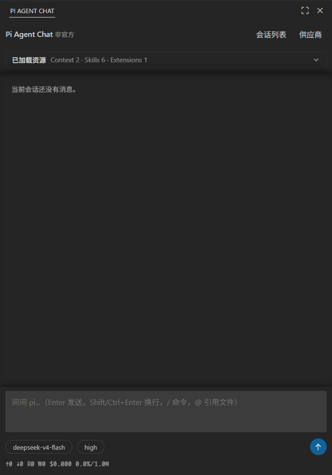
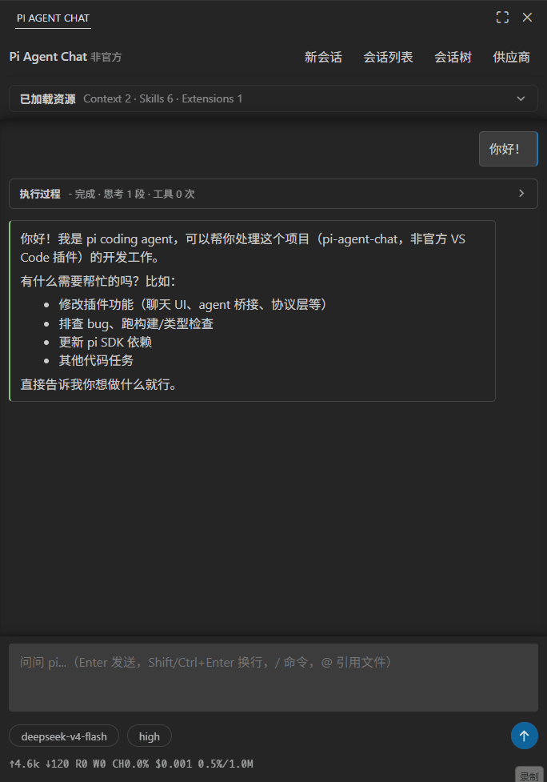

# Pi Agent Chat

English | [简体中文](./readme.zh-CN.md)

The [Pi Coding Agent](https://www.npmjs.com/package/@earendil-works/pi-coding-agent), running natively in your VS Code sidebar — **no Pi CLI installation required**.

This extension is implemented with the **official** `@earendil-works/pi-coding-agent` SDK (**v0.84.1**) bundled directly inside — no RPC bridge, no separate Pi CLI. The agent loop, tools and LLM calls all run in-process, reading and writing your existing Pi configuration and sessions in place. Compatibility is drawn on the **data** side rather than promised feature for feature: both hosts share the same files, but a second host cannot run CLI extensions that need a terminal Pi process (see [Host boundaries](#host-boundaries)).

- Reuses everything under `~/.pi/agent/` (auth, models, settings, extensions, skills, prompts, AGENTS.md) and the default sessions directory, fully interoperable with the terminal Pi: sessions can be listed and resumed from either side.
- **Proxy-aware, and never in disagreement with the CLI.** A global dispatcher is installed exactly the way the Pi CLI does it, with this precedence: `http_proxy` / `https_proxy` (and their uppercase and `no_proxy` variants) from the environment → `httpProxy` in `~/.pi/agent/settings.json` → VS Code's `http.proxy`. The first two levels *are* the CLI's own order; the VS Code level only fills a slot where the CLI would have connected directly — so no `HTTP_PROXY` / `HTTPS_PROXY` needs to be set just for pi, and nothing here changes how your CLI connects. `http.proxyStrictSSL: false` relaxes certificate checking for these requests as well.
- Built-in login/logout flow: if no model is available, an auth page guides you through OAuth or API key setup.
- UI is bilingual (English / Chinese), following the VS Code display language.

> Note: do not resume the same session from the extension and the terminal Pi at the same time — JSONL appends are unsynchronized and would interleave.

## Demo

<p align="center">
  
  
</p>

## Philosophy

Like Pi itself, this extension stays minimal:

- **A second Pi host, not a CLI front-end.** The agent loop, tools, LLM calls and extension/skill loading all come from the SDK, unmodified; the extension adds the UI and what any host has to do itself (auth dialogs, proxy, its own settings). Compatibility is drawn on the **data** side: the same `~/.pi/agent/`, the same sessions, either host able to pick up the other's work. VS Code settings are used only for capabilities unique to this host (currently the subagent tool).
- **Shares the Pi ecosystem.** Context (AGENTS.md), skills, extensions, prompt templates, models and auth are read from the same place and behave as they do in the CLI — except for extensions that need a terminal Pi process ([Host boundaries](#host-boundaries)). The UI itself follows your VS Code color theme (Pi TUI themes are not used).
- **No feature sprawl.** One task line at a time (below), and exactly one tool on top of pi's own set — `subagent`, off by default. Everything else comes from pi or from a pi extension in `~/.pi/agent/extensions/`, shared with the CLI.

## Single-session mode (by design)

One task line runs at a time. While a run is in progress you cannot switch to unrelated sessions or create one, but you can open any session as a **read-only preview** (a banner shows on top; go back to the running session to send messages). Different VS Code windows (different projects) are independent.

Parallel *sessions* are not planned. The scarce resource is your attention, not the model's time: two conversations mean two contexts to hold in your head, and reviewing the result is the part that actually costs you. Several tasks work better as one task list in one session, where the agent also keeps a better grasp of the whole picture — send it, go get a coffee, come back and review.

**Subagents follow from this rule.** What gets parallelized is the *execution*: still one task line, one report to read, one agent to answer to. Subagent panels have no input box by design — you can watch a lane and stop it, so "who am I talking to now?" never becomes a question. Delegation multiplies the machine's work without multiplying the conversations you have to hold.

Overall, this extension bets on simplicity and on the continued progress of the models themselves: the less the agent harness interferes with the model, the better.

## Features

- Streaming markdown rendering (marked + DOM sanitizing whitelist, frame-throttled repaint)
- Tool cards: argument summary, collapsible output, compact colored diff for edit results
- One-click native `vscode.diff` for edit results (reverse-applies the patch to reconstruct the old content) and open-target-file
- Session new / list / resume / delete, with full transcript replay; while a run is in progress, other sessions can be opened as a read-only preview
- Session tree navigation: the **Tree** button or `/tree` opens a QuickPick to switch branches, fork from any node, and label nodes; `/fork` forks from a past user message (original text refilled into the composer), `/clone` copies the current session in place
- Slash command autocomplete: type `/` for candidates covering built-ins, prompt templates, extension commands and `/skill:*`, named and described consistently with the CLI
- Model and thinking-level switching (QuickPick), abort, steer / follow-up
- Provider sign-in (OAuth / API key) plus a **custom provider** entry that opens the shared `~/.pi/agent/models.json` with a fresh commented template every time — the whole file when it is empty, one more provider entry (unsaved, so `Ctrl+Z` drops it) when it already has content. No sign-in is involved there: a `baseUrl`, a model id and any `apiKey` value (a placeholder is enough for endpoints that ignore it) make the model selectable. Saving the file reloads it, lists the models it added, and explains the ones that stay hidden; providers defined in that file carry a 🗑 row action that removes their entry (comments and formatting are preserved)
- Resource listing pinned above the transcript (Context / Skills / Prompts / Extensions), same as the CLI startup listing
- Reopens the session the sidebar was last showing (a fresh, still-empty session included), falling back to the workspace's most recent session when there is nothing to restore or the file is gone
- `@` project file references: type `@` in the composer to fuzzy-search workspace files (respecting `.gitignore`; `Ctrl+→` toggles showing ignored files, which are labeled along with potentially sensitive ones); selected files become removable chips and are sent as plain relative paths for the model to `read` itself
- Subagent (opt-in): one call fans out into several child sessions that each write directly to your working tree within a declared path range, shown as live rows in the parent's transcript

### Subagent (off by default)

One `subagent` call starts several isolated child sessions at once. Each is given a task and a **write range**, works on its own with a fresh context, and reports back; the parent waits for all of them and receives one report. The gain is throughput.

It is **off by default** because it is genuinely aggressive: children write to your real working tree, and nothing is rolled back. Turn it on from the header **Settings → Subagent** form — which asks first whether to save to the workspace or to your user settings, and then writes the three values below — or edit them yourself:

| Setting | Default | Meaning |
| --- | --- | --- |
| `piAgentChat.subagent.enabled` | `false` | Offer the tool at all |
| `piAgentChat.subagent.maxSubagents` | `3` | Ceiling for one call (hard maximum 8); also published to the model as the schema limit. Set it to `1` for plain serial delegation — write ranges are still enforced |
| `piAgentChat.subagent.defaultModel` | *(empty)* | `provider/modelId` for children that do not name one; empty inherits the parent's |

All three are `resource`-scoped, so a `.vscode/settings.json` can enable it in a playground and leave it off in a production repository. Changing them applies to the **next** session: a session's tool set is fixed when the session is built, and rebuilding it silently would throw away the conversation.

**Write ranges are enforced.** Every subagent must declare the paths it may write to, as directory or file prefixes (globs are not accepted — overlap has to be *provable* before anything starts). The call is rejected outright if two ranges could refer to the same file, and at runtime an out-of-range `edit`/`write` is refused at the file-operation layer. Reads are unrestricted: a subagent has to understand code it may not change.

**A refusal is information.** Some changes are inherently cross-cutting — rename a function and its callers move with it — and no partition of the tree can contain them. The report then names the files a subagent was refused, so the parent can finish them itself or split the work differently next time. Cross-cutting work is the part to keep serial: give it to one subagent whose range covers both sides, or fan out first and reconcile in the parent afterwards.

**`bash` is not covered.** Whether a shell command writes, and where, cannot be decided without running it, so the range check and the file bookkeeping cannot see it. Reports say so explicitly for any subagent that ran a command.

**Nothing is rolled back.** A failed subagent may leave half-finished work in your tree, so the report lists exactly which files each one wrote before it stopped, and whether it stopped early. In practice this means: use a git repository, so partial work can be inspected and discarded.

**You only ever talk to the parent.** Subagent transcripts are read-only; each row in the parent's card can be opened to watch, or stopped on its own (the others carry on, and the report says it was you who stopped it, so the parent does not helpfully restart it). Opening a subagent is always your own move — if the run finishes while you are reading one, the back button just grows a marker. This is [single-session mode](#single-session-mode-by-design) holding: the execution fans out, the conversation does not.

**Roles live in your prompt files.** A subagent starts from the task the parent wrote plus the paths it may write to. To give it a role — or to steer *when* delegation happens and how work is split — write that in your project `AGENTS.md` or `~/.pi/agent/APPEND_SYSTEM.md`, which pi feeds to the agent in both hosts. If you already keep role files in a directory — `.claude/agents/` and `~/.claude/agents/` (Claude Code), `.opencode/agents/` and `~/.config/opencode/agents/` (OpenCode), `~/.pi/agent/agents/` (the CLI's subagent extension) — point at it instead of restating them:

```markdown
## Subagent roles
Role definitions live in `.claude/agents/*.md`, one file per role.
Before delegating, `ls` that directory and `read` the roles involved: each file says what the role
owns and how it works. Give each subagent the write range its role owns, and name its role file in
the task so it can read the rest itself.
```

Any such directory works, because nothing here parses it — the agent just lists and reads files, so your existing role files stay usable as they are, in this window and in the CLI, and changing one needs no setting. Reads are unrestricted, so a subagent can open its own role file even when it may not write anywhere near it. The mechanical limits — parallel ceiling, write ranges — live in the tool's schema and are enforced in code.

**With no roles configured, there are no roles.** Delegation does not depend on any of this: the `task` is the entire briefing a subagent gets, and the parent writes it at run time — so without predefined roles, a subagent's role is whatever the parent decides on the spot. Your project `AGENTS.md` still applies: every subagent is a full pi session in the same working directory, so it loads the same context files, skills and extensions. Roles are worth writing down when you want that briefing to come out the same every time, or when the parent keeps splitting the work differently than you would.

**When a subagent's model is unavailable.** If the default subagent model setting names something this window cannot use, the subagent falls back to the parent session's model and a note appears in the parent's transcript. A model the agent asks for itself is different: an unknown one is rejected before anything starts.

#### If you already have a `subagent` extension

A pi extension that registers a tool named `subagent` is **always disabled in this window**, whether or not the subagent tool above is enabled: this window has its own `subagent` tool, and one name must mean one thing here. With the setting on, the SDK's tool registry resolves the name to this window's tool; with it off, the name is excluded entirely. The check matches the tool *name*, is automatic, and is re-evaluated per working directory, so a project-local extension counts too.

An extension-side subagent could not work here anyway: `ExtensionContext` offers no way to start a child session, so an extension delegates by launching Pi again, locating it by introspecting its own process (`process.argv[1]` / `process.execPath`). Inside the VS Code extension host that introspection lands on VS Code's own `bootstrap-fork.js`, which *exists*, so the guard passes and the wrong program is started: exit code 0, no output, no error, and a model that keeps reasoning on an empty result.

Your extension is untouched and keeps working in the Pi CLI, where that introspection is correct. The disabled tool is named in the new-session notice. To make your own implementation reachable here as well, register it under a different tool name.

This is the only tool name treated this way; for extensions that depend on the host in other ways, see [Host boundaries](#host-boundaries).

#### Opening a session with subagent calls in the Pi CLI

Sessions live in `~/.pi/agent/` and are shared with the terminal Pi, so a session containing `subagent` calls can be resumed there, best-effort. Nothing breaks:

- The CLI has no such tool, so the call renders as a generic tool card (name, JSON arguments, text result) — same for `/export`.
- History replays and can be continued; the SDK even inserts synthetic results for tool calls left unanswered (for example when VS Code was closed mid-delegation).
- The report is written to be readable on its own, so the model can still tell what each subagent did and which files it wrote.
- If the model imitates the history and calls `subagent` again, the outcome depends on what that name means over there: with a `subagent` extension installed in the CLI, it gets that tool's schema instead of this window's, so the call may produce argument errors against the wrong parameters; without one, it just receives `Tool subagent not found` and picks another route. Cross-host resumption is best-effort by design — see [Host boundaries](#host-boundaries).

What you lose is the parent↔child link: each child is a **separate** session file named `Subagent: <title>`, listed flat among the other sessions, with no navigation from the parent and not part of its session tree. Delegation itself is unavailable in the CLI.

### Host boundaries

Extensions, skills and settings in `~/.pi/agent/` are shared with the Pi CLI, and the same agent loop from the same SDK runs behind both. Shared configuration is not shared host capability, though: this window is a second host for Pi.

The extensions that notice are those that **introspect their own process** — typically to re-launch Pi as a child process, since `process.argv[1]` and `process.execPath` describe Pi itself when Pi is the running program, and VS Code inside the extension host. Such an extension may misbehave here while working perfectly in the terminal, and there is no general way to detect it in advance: if an extension tool behaves oddly here but works in the CLI, this is the first thing to check.


As always, never resume a session in the CLI while the extension is running it: session JSONL is append-only without locking.


## Install and development

Marketplace builds cover Windows x64, Linux x64 and macOS arm64; when installing manually, pick the VSIX matching your platform. Building from source, running the Extension Development Host, the headless smoke test and the code map are all in [`docs/development.md`](./docs/development.md); the full module map is in [`ARCHITECTURE.md`](./ARCHITECTURE.md).

## Disclaimer

This is an **unofficial**, community-built extension. It is **not affiliated with, endorsed by, or maintained by** the upstream Pi project or Earendil Works. All trademarks belong to their respective owners. Use at your own risk.

## License

[MIT](./LICENSE). Note that the bundled `@earendil-works/pi-coding-agent` SDK and its dependencies are licensed under their own terms.
